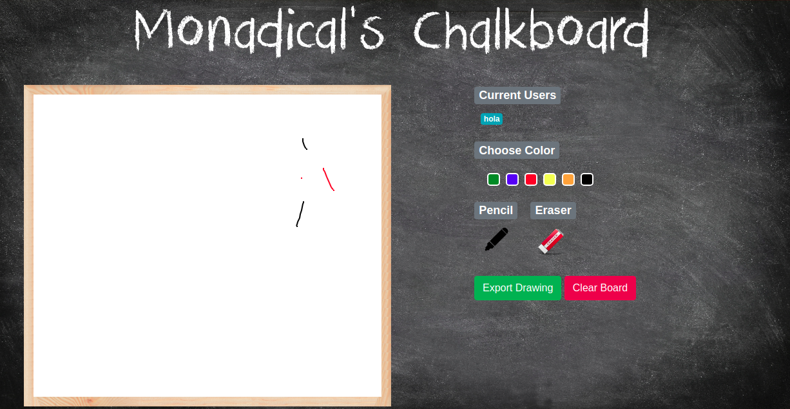

# Shared-Chalkboard


A canvas that people can draw on, each person’s strokes are visible in a color specific to that person. The drawing is saved continously to the server, as an append-only log of strokes, if the user refreshes it is displayed without any data loss.


## Installation:
 
* Install redis-server
* Clone the project: https://github.com/caroguza/shared-whiteboard.git
* Create a Python3 Virtualenv and activate it:

```
virtualenv -p `which python3.6` venv
```

* Install requirements:

`pip install -r requirements.txt`


## Execution:  

* In the active Virtualenv and the project directory run 
```
python manage.py runserver 4000
